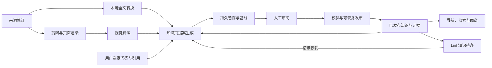

# 知识库重构为 LLM Wiki 双层架构

> **Parent ADR**: [ADR 0034：知识库重构为 LLM Wiki 双层架构](../adr/0034-llm-wiki-knowledge-base.md)
>
> **Glossary**: [CONTEXT.md](../../CONTEXT.md) → 知识库域
>
> **状态**: 源码复核修订稿，待本轮整体审定；技术 spike 尚未执行。
>
> **源码证据**: [核查报告与绝对路径索引](knowledge-base-llm-wiki-source-audit.md)（参考提交 `e8082119649e6a8e1cf85eaf289adcabfdf39d4e`）。

## Problem Statement

SoC 验证周期里会积累大量非代码文档：协议手册（AMBA/MIPI/DDR）、DUT spec、验证计划、设计评审材料。这些文档的知识是**跨文档分布**的——同一个 AXI outstanding 限制可能同时出现在 AMBA 手册、DUT spec 和验证计划里；同一个寄存器可能有两份互相矛盾的描述。而验证工程师需要的往往是这类跨文档的结论，而不是某一篇文档的某一段。

现有知识库（ADR 0021 交付）解决了"文档能被 AI 读到"：anydoc 本地转换、单库挂载、index.md 注入、`kb_search` 检索。但它把知识停在**被打标签的文档**这一步——每篇文档转换出一份全文 Markdown，由 LLM 打上分类、摘要、关键词，然后就没有了。由此产生四个具体问题：

1. **每次提问都要重新拼装。** 需要综合三份文档才能回答的问题，Agent 每次都要重新检索、重新拼装，答案落在聊天记录里就消失了。知识没有复利。
2. **跨文档的关联无人发现。** 同一概念的重复定义、新旧来源之间的矛盾、重要但缺失的概念页，没有任何机制去发现它们。
3. **知识资产不可累积。** 新文档进来只是多了一条索引条目，既不会更新既有认识，也不会标注它推翻了什么。
4. **知识库无法演进。** 结构一旦调整，已入库的内容就成了负担；旧库没有出路，只能持续维护旧实现。

用户需要的是：把读过的资料**编译成一份持续更新、互相引用的知识资产**，而不是一个需要每次重新检索的文档仓库。

## Solution

知识库重构为**双层结构**，并把 LLM Wiki 模式（知识编译一次、随后保持最新）落地到 SoC 验证域：

- **Raw Layer** — 原始层。保留源文档当前原件、被引用的历史修订、全量转换产物和图片。原件是受保护证据，只有派生转换产物可在对应原件仍在时重建。
- **Wiki Layer** — 编译层。经审阅发布的知识页及应用聚合页。重新生成无法保证复原已有知识取舍，因此知识页与日志需保护；索引与汇总可重建。

上传文档后自动进入编译队列，LLM 把来源的知识提炼成**源摘要页**（单一来源的结构化摘要）与**跨源知识页**（协议规则、接口寄存器、验证方法学、已知问题）。页面之间用 wikilink 互相引用，应用从中构建知识图谱。

**分工是清晰的**：LLM 生成知识页提案，应用校验后发布；人能读、能审阅、能拒绝，但不提供自由正文编辑；应用负责目录结构、索引聚合、日志、队列、快照与检索——这些是确定性的事，不交给模型。

**人通过审阅队列掌握控制权**：编译产物先落暂存区，人看到逐块 diff 后接受或拒绝，接受才进编译层。这提供了发布前控制与可追溯回滚，但不能保证模型结论正确；仍需证据校验、基线冲突检测和可恢复发布。

最终，Agent 通过有界导航注入、关键词/向量混合召回与图扩展消费知识；用户可主动将有价值问答提交为 query 页。图片提取与 AI 读图本期接入，原图和模型解释分开。知识图谱同时支持结构检查、语义检查候选选择与可视化。



## User Stories

### 知识库结构与注册

1. As a SoC 验证工程师, I want 注册一个空目录就得到完整标准结构, so that 我不需要手工摆目录或记约定。
2. As a SoC 验证工程师, I want 知识库自包含、可整体拷贝到另一台机器, so that 我能把库连同内容分享给同事。
3. As a SoC 验证工程师, I want 明确知道哪些内容是「删了能重建」、哪些「删了就没了」, so that 我敢清理磁盘而不用担心丢知识。
4. As a SoC 验证工程师, I want 应用识别旧结构库后明确提示重建，并从活动列表移除其登记、保留处置记录, so that 列表里不残留点了会出错的条目。

### 文档上传与转换

5. As a SoC 验证工程师, I want 拖拽或选择上传 pdf/docx/pptx/xlsx 等文档, so that 我的原始资料能进入知识库。
6. As a SoC 验证工程师, I want 原始文档副本被完整保留, so that 重新转换不需要重新找源文件。
7. As a SoC 验证工程师, I want 每份文档都产出全量 Markdown 并保留, so that Agent 能全文检索、我能对照原文查看。
8. As a SoC 验证工程师, I want 文档里的框图、时序图、位段图被提取为独立图片资产, so that 关键信息不丢失。
9. As a SoC 验证工程师, I want 同一相对路径重新上传时创建新修订并自动重转，保留被引用的旧原件, so that 更新规格书是一步操作。
10. As a SoC 验证工程师, I want 转换失败的文档显示具体错误码并可重试, so that 我知道是加密、格式不支持还是文件损坏。
11. As a SoC 验证工程师, I want 原始层的目录结构与我的来源组织方式一致且不漂移, so that 我能按自己的习惯浏览。

### 知识编译

12. As a SoC 验证工程师, I want 上传后自动编译出该来源的摘要页, so that 我不需要额外触发就能得到要点、参数表与章节地图。
13. As a SoC 验证工程师, I want 多个来源提到的同一主题被聚合成一份跨源知识页, so that 我查一个约束时拿到的是汇总结论而不是三份原文。
14. As a SoC 验证工程师, I want 知识页分为多种类型（源摘要、实体、概念、对照、综合、问答、已知问题、接口）, so that 我能按类型浏览和筛选。
15. As a SoC 验证工程师, I want 编译严格遵守知识库自己的写作规则, so that 页面不会长到错误的目录里。
16. As a SoC 验证工程师, I want 每份来源被打上主题标签, so that 我能按「协议手册」「DUT spec」这类领域找到东西。
17. As a SoC 验证工程师, I want 「已知问题」页按「现象 → 根因 → 规避 → 证据」组织, so that 我能把文档知识和实际踩过的坑连起来。
18. As a SoC 验证工程师, I want 「接口」页包含信号表、位段与接口时序, so that 我能做接口级字段定位而不是读一段散文。
19. As a SoC 验证工程师, I want 编辑知识库的写作规则与目标文档, so that 我能影响 LLM 的取舍与页面约定。
20. As a SoC 验证工程师, I want 知识页里引用关系用双链表达, so that 我能从一个概念跳到相关概念。

### 编译队列与增量

21. As a SoC 验证工程师, I want 看到每个编译任务当前处于哪个阶段, so that 我能判断要等多久。
22. As a SoC 验证工程师, I want 暂停整个队列, so that 临时不想消耗模型额度时能停下。
23. As a SoC 验证工程师, I want 恢复已暂停的队列, so that 我能继续之前的工作。
24. As a SoC 验证工程师, I want 重试失败的任务, so that 网络或额度问题不会让文档永久卡住。
25. As a SoC 验证工程师, I want 取消排队中或执行中的任务, so that 我能收回误触发的编译。
26. As a SoC 验证工程师, I want 调整任务执行顺序, so that 紧急要用的文档能先编。
27. As a SoC 验证工程师, I want 内容未变的文档不重复编译, so that 批量重扫不会浪费时间和额度。
28. As a SoC 验证工程师, I want 关闭应用后队列不丢失, so that 未完成的工作不会凭空消失。
29. As a SoC 验证工程师, I want 重新打开应用后继续未完成的任务, so that 我不需要重新上传。
30. As a SoC 验证工程师, I want 批量导入几十份文档时不阻塞界面, so that 我能继续做别的验证工作。

### 变更审阅

31. As a SoC 验证工程师, I want 编译产物先暂存、经我审阅后才进入编译层, so that 知识库不会出现模型写坏的半成品。
32. As a SoC 验证工程师, I want 看到一次编译改动了哪些页面, so that 我能判断这次改动是否可信。
33. As a SoC 验证工程师, I want 对改动逐块接受或拒绝, so that 我可以只要页面的正确部分。
34. As a SoC 验证工程师, I want 整页接受或拒绝, so that 面对大改动时不必逐块点。
35. As a SoC 验证工程师, I want 拒绝后编译层保持原样, so that 一次坏编译的代价只是丢弃。
36. As a SoC 验证工程师, I want 审阅入口与代码改动的 Diff Review 是同一处, so that 我不需要记住两套审阅流程。
37. As a SoC 验证工程师, I want 编译产出的待办建议（缺页、矛盾）也进入同一个审阅队列, so that 所有需要我决策的事集中在一处。

### 页面历史与回滚

38. As a SoC 验证工程师, I want 每次页面被修改前都有快照, so that 编译层永远不会被一次坏改动不可逆地破坏。
39. As a SoC 验证工程师, I want 把某一页回滚到历史版本, so that 我能修复单页的退化。
40. As a SoC 验证工程师, I want 看出某个论断是什么时候、因哪次编译写进去的, so that 我能追溯结论的来源。

### 索引与聚合页

41. As a SoC 验证工程师, I want 索引由应用聚合生成而不是模型重写, so that 它不会因为输出截断而漏掉页面。
42. As a SoC 验证工程师, I want 索引里每个页面带标题、摘要、关键词、类型与标签, so that 我一眼就能判断要不要点进去。
43. As a SoC 验证工程师, I want 任何新页面都必须被索引登记, so that 库变大了也不会有找不到的知识。
44. As a SoC 验证工程师, I want 操作日志是追加式的、带统一前缀, so that 我能用简单命令查出最近发生了什么。
45. As a SoC 验证工程师, I want 一份跨类型的全局汇总页, so that 我能快速了解库的整体状态。
46. As a SoC 验证工程师, I want 直接打开索引文件阅读, so that 我能把它当作库的目录来用。

### Agent 检索与消费

47. As a SoC 验证工程师, I want Agent 会话启动时知道库的类型骨架、规模与部分页面入口, so that 我不需要先告诉它库在哪。
48. As a SoC 验证工程师, I want Agent 能按关键词、语义与引用关系检索知识库, so that 它能找到跨文档的结论。
49. As a SoC 验证工程师, I want 检索结果带上页面类型与它引用的其他页面, so that Agent 能顺藤摸瓜地深入。
50. As a SoC 验证工程师, I want 没有可用的向量端点时检索自动降级但不中断, so that 内网环境仍能正常使用。
51. As a SoC 验证工程师, I want Agent 能读取单个知识页与原始层的全文, so that 它既能拿结论也能查原文。
52. As a SoC 验证工程师, I want Agent 能把仿真日志、覆盖率、用例的引用当作知识页的证据, so that 结论可追溯到实际数据。
53. As a SoC 验证工程师, I want Agent 视角的上下文注入有明确预算, so that 库变大不会挤爆会话上下文。

### 知识图谱

54. As a SoC 验证工程师, I want 看到库的知识网络力导向图, so that 我能看出哪些主题是枢纽、哪些是孤岛。
55. As a SoC 验证工程师, I want 图按知识聚类着色, so that 我能识别出领域分组。
56. As a SoC 验证工程师, I want 点击图中节点直接打开对应页面, so that 图能当导航用。
57. As a SoC 验证工程师, I want 每个页面附一份「相关页面」列表, so that 我能从单个页面发现邻近知识。
58. As a SoC 验证工程师, I want 在图上按类型或关键词筛选, so that 大图里我能聚焦关心的部分。

### 健康检查

59. As a SoC 验证工程师, I want 主动触发一次知识库健康检查, so that 我能知道库现在有哪些问题。
60. As a SoC 验证工程师, I want 检查出页面之间的矛盾与被新来源推翻的过时论断, so that 我能纠正错误认识。
61. As a SoC 验证工程师, I want 检查出被提到但还没有独立页面的重要概念, so that 知识盲区能被补上。
62. As a SoC 验证工程师, I want 检查出孤儿页、断链和无出链的页面, so that 结构问题不靠人工发现。
63. As a SoC 验证工程师, I want 检查出内聚度低的稀疏社区与连接多个领域的桥接节点, so that 我能看出知识结构上的薄弱处。
64. As a SoC 验证工程师, I want 健康检查的发现进入与编译审阅同一个队列, so that 我不需要去第二个地方处理。
65. As a SoC 验证工程师, I want 忽略某条不打算处理的发现, so that 队列不会被噪声长期占满。

### 库管理

66. As a SoC 验证工程师, I want 注册多个知识库并把其中一个挂载到当前项目, so that 跨项目复用的协议手册与项目专属 spec 各有归宿。
67. As a SoC 验证工程师, I want 切换当前项目挂载的库, so that 我能按任务切换知识上下文。
68. As a SoC 验证工程师, I want 卸载或注销一个库而不删除文件, so that 我能停用而不丢数据。
69. As a SoC 验证工程师, I want 删除库时明确告知会删掉什么, so that 我不会误删原始资料。

### 开发者与发布

70. As a 开发者, I want 知识库模块按新架构重组且不留兼容分支, so that 每次架构演进不需要维护两套实现。
71. As a 开发者, I want 新增依赖使用精确版本与 lockfile, so that 发布构建可复现。
72. As a 开发者, I want 代码与界面命名中不出现版本后缀, so that 新结构就是唯一结构，没有歧义。
73. As a 开发者, I want 向量索引与图谱这类派生数据集中在应用内部状态目录, so that 库的可拷贝性与「可重建」不变量不被破坏。
74. As a 发布负责人, I want 原生依赖在打包后能正常加载, so that 安装包在用户机器上不会因 ABI 或解包问题启动失败。

### 本轮补充：视觉与问答沉淀

75. As a SoC 验证工程师, I want PDF 的矢量时序图也可提取或渲染并定位原页, so that 图中关键信息不会被文字转换遗漏。
76. As a SoC 验证工程师, I want 模型解读图片并标出不确定项, so that 我能结合原图审阅它的结论。
77. As a SoC 验证工程师, I want 看见读图覆盖范围和失败项并可重试, so that 部分完成不会被误认为完整理解。
78. As a SoC 验证工程师, I want 新版规格上传后仍能打开旧结论使用的原文, so that 已发布知识和回滚历史可追溯。
79. As a SoC 验证工程师, I want 主动把选定问答保存为 query 页提案, so that 有价值回答能经审阅成为可复用知识。
80. As a SoC 验证工程师, I want 区分知识待办处置与页面变更批准, so that 忽略一条建议不会误修改知识库。

## Implementation Decisions

本节给出本项目契约；“参考 Rxx / Lxx”均指 [源码索引](knowledge-base-llm-wiki-source-audit.md) 的绝对路径。参考实现只证明该机制存在，不代表已经满足下述发布与证据要求。

### 已确认的产品边界

2026-09-13 本轮逐项确认：

1. 知识页必须人工审阅后发布，按一次编译的关联候选集校验。
2. 本期支持图片提取与 AI 读图，不再只预留视觉能力。
3. 保留被已发布知识页、页面历史、待审阅变更引用的旧版原件。
4. 提供用户主动触发的“保存为知识页”，问答提案进入同一审阅发布路径。

沿用原 ADR 的单用户 Electron、单库挂载、本地转换、不做旧库兼容和正文自由编辑等边界。下列技术参数是初始实现基线，需按验收样例校准，不是上游性能结论。

### 1. 资产、布局与来源修订

沿用 ADR 的 `raw/`、`wiki/`、库根 `schema.md` / `purpose.md` 与 `.kb/` 布局；路径推导只由现有 `layout.ts` 的替代实现拥有（L01）。

| 内容 | 权威性与清理规则 |
| --- | --- |
| `raw/sources/<sourcePath>` | 最新原始字节，必须保留；模型无写权限 |
| `raw/revisions/<sourceId>/<sourceRevision>/` | 被引用旧原件及其当时转换快照；保存原文件名、parsed 内容/定位清单。受保护，不自动 GC |
| `raw/parsed/<sourcePath>.md` | 最新机械转换全文，保留原扩展名；仅本地转换器生成，不插入模型图像解读 |
| `raw/assets/<sourceId>/<sourceRevision>/` | 原图、必要的页面渲染图和资产清单；保持图片 hash、页码/slide、尺寸、提取方式及坐标（能可靠获取时） |
| `wiki/<类型目录>/*.md` | 已发布知识页，受审阅与历史保护 |
| `wiki/index.md`、`overview.md` | 可由已发布页重建；聚合顺序确定，排除自身及 log |
| `wiki/log.md` | 追加操作记录，不能由当前页重建或作为普通缓存清理 |
| `.kb/manifest.json` | 库身份、来源修订与转换状态、发布 revision；需持久保护 |
| `.kb/staging/`、`reviews/`、`page-history/`、`transactions/` | 未决提案、用户选择、历史和恢复日志；未终结前不可清理，历史本期不自动过期 |
| `.kb/vectors/`、图索引、compile-cache | 派生索引可重建；损坏不能影响原件或已发布知识 |
| `.kb/vision/`、长文档 checkpoint | 未发布模型中间产物；可显式丢弃重算但不是无成本可重建。已采用的图像解释保存在知识页和页面历史 |

身份规则：

- `sourcePath` 是相对于 `raw/sources/` 的规范路径，持久化使用 `/`；拒绝绝对路径与穿越。Windows 大小写等价、Unicode NFC 归一后检测碰撞，保留显示拼写。
- `sourceId` 由规范化的完整相对路径计算 SHA256（包括目录与扩展名），用于目录/任务身份；绝不再用不含扩展名的 docName。`a/report.pdf`、`b/report.pdf`、`a/report.docx` 是三个来源。
- `sourceRevision` 为原始字节 SHA256；同路径同字节无需新修订。转换另记引擎/配置指纹和 `parsedHash`，不能把“原件未变”等同“转换未变”。
- `pageId` 使用相对 `wiki/` 的规范路径（去掉 `.md`，保留类型目录），如 `concepts/axi-outstanding`；跨目录同 basename 不共享身份。模型复用既有 pageId；改变标题不自动改 pageId。
- 库内持久化只保存相对路径、稳定 kbId 和来源修订；注册表保存本机根路径。复制到其他位置后重新注册，若 kbId 已注册于另一活跃路径则明确要求按副本赋予新 kbId，不能让两个目录共享写队列。

导入步骤：先拷入临时文件并计算 hash → 校验路径/格式 → 保存仍被引用的旧修订 → 原子替换当前原件及 manifest → 持久入队 → 返回 sourceId/taskId。转换先产出临时 parsed/assets，成功后切换；即便原件字节未变，只要转换配置改变，也必须将仍被引用的旧 parsed 保存为 `raw/revisions/<sourceId>/<sourceRevision>/parsed/<parsedHash>.md`，旧版原件只保存一份；失败保留旧修订和旧转换记录，并标记新修订失败，不让 UI 将旧 parsed 显示成新版。

所有入口携带 sourceId/revision。上传目录保留相对结构；仅文件列表选择没有目录语义时用文件名。来源支持范围由引擎能力清单确定，UI、工具描述与后端共用，不能继续声明引擎未支持的 `.html`。若支持直接 Markdown/text 导入，则不调用 anydoc，按 UTF-8 文本保存机械全文；输出同样为 `<sourcePath>.md`，如 `notes.md.md`，无隐式特例。

删除来源先计算引用影响、取消关联活动任务；不直接级联删除知识页。被页面/历史/提案引用的原件仍留修订区，当前来源标为 withdrawn，并将受影响页标为待复核；更新/删除知识页通过审阅发布。本期不提供源重命名或自动监听，外部改变由显式刷新/重新导入发现。（参考 R02、R03、R07、R15。）

### 2. 页面、链接和证据契约

固定八种 type：`source/entity/concept/comparison/synthesis/query/pitfall/interface`，默认分别路由到 `sources/entities/concepts/comparisons/synthesis/queries/pitfalls/interfaces`。`schema.md` 的 `## Page Types` 是受约束表：类型完整且唯一、目录唯一且位于 wiki 内、无保留聚合路径。无法解析、缺类型、未知类型或冲突路由一律报错并停止编译，不能像参考 R06 一样回退到无约束。

用户可以修改写作规则、模板与 purpose；本期不支持任意新增类型。已有页面的类型路由重映射需要专门迁移，本期保存时拒绝这种变更并解释受影响页面；仅写作要求变更使编译缓存失效，不自动触发全库付费重编。

每页最小 frontmatter：`type`、`title`、`summary`、`keywords: string[]`、`tags: string[]`、`sources: SourceRef[]`、`created`、`updated`。来源引用格式由应用写回；日期由应用统一为 ISO 时间，不信任模型时钟。标题、类型、创建时间在普通合并中锁定；摘要和关键词可更新但必须重新校验长度/类型。YAML 使用安全解析/序列化，拒绝重复键、非法对象类型与过深结构，不用正则模拟完整 YAML。

`SourceRef` 最小字段：`sourceId`、`sourceRevision`、`parsedHash`。对应的正文证据另有稳定 `evidenceId`、页码/标题路径/UTF-16 起止偏移（可靠取得哪些就保存哪些）、原文短引、可选 `assetId`。不要让模型编造 PDF 页码。示例：

```yaml
type: concept
title: AXI outstanding 限制
summary: 区分协议允许范围与 DUT 当前实现上限。
keywords: [AXI, outstanding]
tags: [协议约束]
sources:
  - sourceId: "<完整路径 SHA256>"
    sourceRevision: "<原件字节 SHA256>"
    parsedHash: "<转换文本 SHA256>"
created: "2026-09-13T01:00:00Z"
updated: "2026-09-13T01:00:00Z"
```

证据和图片定位清单由转换/导入层提供，LLM 只选择已有 evidenceId；编译器在提案中写入真实引用。关键寄存器名、单位、位宽、复位值、时序条件须保留原值。文档新旧或协议/DUT 差异应并列标出处置范围，不能按导入时间自动认定新文档更权威。

链接采用 `[[concepts/axi-outstanding|显示名]]`，允许 `#heading`。主进程提供一个解析实现供图谱、Lint、检索与 UI 消费：忽略围栏/行内代码、转义和图片 embed；裸名仅在唯一命中时解析，歧义显式报告，禁止取第一个。frontmatter 的来源引用是证据边，不是 wikilink；图扩展只消费已解析的页面引用边。

知识库预览与通用文件编辑器识别受管 Wiki 页面并只读；应用受控写入入口不得绕过 KB 发布服务。外部编辑器、shell 或其他进程仍可能改磁盘，不承诺操作系统级防写，重新读取与发布前须检测文件哈希变化。

普通 Agent 读取、检索与上下文只消费已发布页；staging 和历史不进入默认检索。来源已更新但旧知识未发布新修订时，旧页仍可读，但显示 `stale` 及其实际来源修订。`log://`、`case://` 等仅保存引用与所属项目，不承诺占位 handler 能返回正文；失效引用显示 unavailable。（R05、R06、R11；L05。）

### 3. 图片提取与视觉解读

本期必须交付 PDF 图片提取、原文定位和 AI 读图，范围包括文字 PDF 中的框图、位段图、时序图；Office 提取保留现有能力并报告各格式的支持程度。

- PDF 图片对象提取不能覆盖矢量图。spike 优先评估现有 pdfjs 本地解析/渲染能力；对含图页提供整页渲染作为读图证据，无法可靠自动判断含图时分批渲染，用户可选页或继续下一批。必须统计总页、已处理页、跳过/失败页及原因，不能默默只取前 N 张。页面渲染缓存可重建。
- 资产以来源修订和图片字节 hash 定位，文件名使用内容 hash，参数变化不能覆写已有引用；同图多次引用复用字节，但各出现位置保留。PDF 用 1-based 页码，PPTX 用 slide，DOCX 不伪造固定页码。矢量图/Office chart 未能提取时提供原文入口和明确覆盖提示。
- `KbSettings` 增加 compile、vision、embedding 三种角色配置，保存 credentialId/providerId、model、上下文/输入上限。视觉可显式选择经验证支持图片输入的编译模型；不能因文本 chat 成功就认定支持图片。凭证仍由主进程 credential manager 管理，不写进库、队列或 renderer。
- 模型输入由受管本地图像字节与必要相邻原文组成，不把绝对文件路径当成远端模型可读图片。解析图片仅允许受管资产，远程 URL 不自动下载，SVG 不作为可执行 HTML 渲染。
- 图像解读输出：图类型、可见元素/信号、关系或时序、可辨认的原文数值、无法确定项、assetId 与来源位置。没有清晰数值则写“不清晰”，不得补齐或换算未经证据支持的位宽/时序。输入图和解读可并排查看，正文注明“模型图像解读”。
- Parsed Markdown 只保存机械转换结果；视觉解读作为编译输入附录，随知识页提案审阅。不能把 caption 替换进 raw 全文后声称是原文。
- 视觉缓存键至少包含图片字节 hash、处理/裁剪参数、模型配置指纹、输出语言、提示版本和邻近文本 hash。参考 R13 缓存只按图片/语言不足以处理同图不同场景。失败不写成功缓存；使用中的异步请求去重，有限并发且受任务取消控制。
- 默认视觉并发 1，PDF 渲染逐页释放内存；每批最多 50 页、单张发送最长边初始上限 2048px（以端点能力适配）。细小位段可提供带坐标的原分辨率裁片。超过限制进入 `blocked` 等待缩小范围/继续批次，不把遗漏当成功。
- 未配置视觉模型：本地转换与看图仍可用，任务标记 `blocked(visionNotConfigured)`。单图读图失败保留已完成结果、提供重试；只有用户明确选择“仅按文字继续”才可生成不完整提案，并在审阅和来源摘要中列出缺失图，不能暗中降级。
- 无文本层的扫描 PDF 本期仍不承诺完整 OCR/全文编译；原图可预览，必须区分视觉概述与全文原文。测试覆盖文字 PDF 中的矢量时序图，不能仅用嵌入照片证明支持。

参考绝对路径：R13；现有本地 PDF worker 为 L02。是否需新增渲染原生依赖由 spike 决定，不能先假定 pdfjs 的 renderer 配置可直接搬进主进程 CJS。

### 4. 编译内核、上下文与增量

编译由主进程服务编排，直接调用模型适配器，不创建 Agent 会话。保留 L03 的多协议与凭证治理，补真正的流式消费、终止原因、usage 和 AbortSignal，不复制参考 renderer 全局 store。

1. 取得固定 sourceRevision、schema/purpose hash、模型配置快照和当前已发布目录。
2. 用来源标题/主题在已发布知识中检索候选页，实际读取有关页面正文及证据并记录读集；只有 index 标题不足以完成跨来源合并。
3. 来源全文在预算内时输出简洁结构化分析；超预算则按章节分段、分析各段并保存 checkpoint，再归并分析。保留章节覆盖清单与关键表格/信号定义证据，不能只读取前若干字符。
4. 生成 FILE/REVIEW 提案；按需合并既有页，构建候选集并验证来源、页面元数据与链接；完整后进入持久 staging。
5. 人工审阅后发布，成功才更新 compile-cache；图谱/关键词/向量刷新独立计状态。

预算按输入、system/schema/purpose、已有页、输出预留统一计算；优先使用实际 token 估计器，不以同一 chars/token 比例同时处理中文和英文。若配置预算不足以放最小原子证据，进入可操作的 `contextBudgetExceeded`，不能截掉参数表后继续。长文档编译 chunk 与 embedding chunk 分别建契约：前者要覆盖全文并保留证据，后者用于召回。

表格与围栏为原子证据；过大时编译可以按行分批并重复表头/保留行号，或按代码行窗口保留完整原文定位，输出清单必须证明所有行处理过；不能用普通字符切片假装语义分块。checkpoint 键包括 sourceRevision、parsed/vision 指纹、schema/purpose、模型/提示与分块设置，只恢复完全匹配的已完成块。

FILE 协议允许多个 `---FILE: wiki/<path>.md--- ... ---END FILE---`，REVIEW 允许类型/标题/涉及页面/证据，解析时分别限制大小、块数与字段。有限状态解析必须覆盖 CRLF、标记大小写、空路径、围栏内伪标记、重复路径、嵌套 opener 和流截断；跨 token 分片不影响结果。重复目标块报错，不使用最后一个静默覆盖；未闭合块不得作为完成文件。

流因 length 截断或缺必需源摘要时只允许一次有界修复调用，修复目标限制为缺失/截断的路径，仍失败就保留诊断并报 failed；不得发布一个 fallback 摘要后宣称整个来源成功。源摘要路径由应用根据 sourceId 生成，模型不能为别的 source 伪造来源页。

路径校验同时执行词法和真实路径检查：拒绝盘符相对 `C:foo`、UNC/device、ADS `:`、绝对路径、`..`、NUL、Windows 保留名、尾点/尾空格；解析父目录的 realpath 防 junction/symlink 逃逸，提交前再检一次。只接受 schema 路由内 Markdown；schema/purpose、聚合页、原件与 `.kb/` 不是 FILE 可写目标。源内容是数据而非指令；路径沙箱只能限制落盘范围，不能证明生成知识可信。

合并策略：跨来源页面正文由模型提案合并、来源引用去重、锁定字段应用写回；同来源新修订必须允许撤回旧论断，不能无限 union 旧文案。保留其他来源贡献并标注冲突。缺 frontmatter、异常收缩（初始阈值 70%）、来源丢失或中止时保留旧页并阻止该提案发布；阈值只作风险信号，不证明语义正确。合理的大幅删减通过独立可审阅修订重新提出，不自动覆写。

成功缓存记录 sourceRevision + 转换/视觉/schema/purpose/编译指纹 + 读依赖 + 已发布产出清单。命中还需验证产出存在和来源修订未失效。待审阅不记成功；全拒绝记录本次决定，普通刷新不重新烧 token；用户显式重编译创建新尝试。部分接受标为 `published_partial`，不冒充完整成功缓存。接受后衍生索引失败只重试索引，不重跑编译。（R01、R03、R05、R06、R10。）

### 5. 持久队列与应用生命周期

队列以 kbId 为归属，不以当前 UI 项目为全局可变身份；一库同一来源同修订去重，所有阶段携带 taskId/attemptId。库级单写协调器用于编译发布、来源更新/删除、回滚与规则修改。初始 worker 并发 1，接口支持有界并发扩展，不能靠并发掩盖正确性缺口。

状态：`queued → converting → vision → analyzing → generating → validating → awaiting_review → committing → published`。可终结为 `rejected/cancelled/failed/published_partial`，配置/预算不足为 `blocked`；`stale` 表示提案基线或来源已变化，需重新生成差异。phase 与进度分开保存，不能把每个状态都当百分比可相加。

| 动作/故障 | 契约 |
| --- | --- |
| 暂停 | 持久化 paused，停止派发和中止未提交的模型请求；保留 checkpoint/提案。正在提交的短临界区先完成或恢复，不能写一半就释放锁 |
| 恢复 | 只处理仍有效的任务；每次重启恢复到安全阶段，已生成完整 staging 直接继续审阅，不再请求模型 |
| 应用重启 | 先恢复发布事务，再显示已恢复任务；未完成计算默认等待“继续队列”，不因启动意外付费 |
| 取消 | queued/计算中/待审阅可取消；标记 attempt 失效，迟到响应不可写盘或发布。committing 返回“正在提交”，完成后可走回滚 |
| 重排 | 仅 queued 可调整；不能改变当前正在发布的批次 |
| 重试 | 同 taskId 新 attempt，保留失败原因；已完成转换/视觉/checkpoint 可复用，指纹不符则重算 |
| 同路径新上传 | 旧 attempt 标过时，阻止旧提案针对新原件发布；原已发布页绑定旧 revision，保留可读 |
| 切换/卸载项目 | 暂停该项目发起且尚在计算的任务；请求绑定原 kbId，不转写新库。等待当前提交完成后解除挂载，待审阅保存在库内 |
| 断网/限流 | 网络和 429 最多 3 次有界退避（遵循 Retry-After）；401/403、坏模型或配置阻止自动重试并给配置入口 |
| 持久化失败 | 不确认入队/暂停等操作成功；原子临时文件替换，坏 JSON 保留损坏副本并报恢复错误，禁止静默清空 |

读取凭证仅在调用时通过配置引用解析；任务保存 model/provider 和配置 hash，不保存 API key/请求头。记录每阶段 usage、耗时、重试数、错误码，现有 Token Monitor 如需旁路接入走公共记录入口，不伪造 Agent 会话。真实费用未知时显示 token 用量，不杜撰金额。（R04；L03、L06。）

### 6. 审阅、发布与页面历史

共用审阅入口，数据用明确种类区分：现有 `code-applied` 保持“已写入，拒绝撤销”；新 `kb-staged` 保存 before/proposed、基线哈希、来源修订、变更集、用户选择；`kb-finding` 保存知识问题与处理状态。只复用可接受 before/after 的 diff 计算/展示，不制造工具调用去满足旧数据结构。（L04、R14。）

- 审阅选择持久保存。已存在页正文支持逐 hunk；新页和 frontmatter 整体接受/拒绝，避免拼出无效 YAML。选完后计算最终候选页，重新检查元数据、来源与引用；所有未决项必须明确处置才能发布此次变更集。
- 本次新增链接若目标被拒绝或不存在，则阻止发布并定位对应 hunk；预先存在的坏链接可作为 finding 保留，不能让无关旧问题阻止所有改动。所有涉及被删除页的新旧入链都必须纳入校验，旧断链例外不能用于绕过本次删除影响。
- 点击发布时持有库锁，校验写集基线与实际参与推断的读集。若其他编译、回滚、来源更新、规则修改或外部编辑改变基线，进入 stale，重新生成候选并清除相关旧批准；不在批准之后悄悄做 LLM merge。
- 明确范围：当前页 path 不变的内容修订为本期默认；删除页只允许显式生成的删除提案，需同步处置入链。模型不能通过空 FILE 意味着删除。
- 发布写持久事务清单（commitId、读/写集 hash、before/after、目标 revision、状态），先确保旧页快照持久，再逐文件临时写 + rename，完成聚合与 manifest 后标 committed。失败恢复为完整旧版或完整新版；事务未恢复前同库的读取/检索 API 暂停，避免读到混合页集。
- 单次 rename 的原子性不能推广成整个目录事务。明确只保证本应用接口的可见性，无法约束外部编辑器直接读取磁盘；磁盘不支持所需写语义时失败，不宣称原子发布。
- 页面目录/关键词查询以 committed revision 为读取快照；图索引若尚未追上该 revision，则暂不使用图扩展并报告 rebuilding，不能用旧边推导最新页面。
- `commitId` 在日志、历史和事件中唯一；重启重放不能重复历史或日志。`wiki/log.md` 用 `## [ISO日期] <operation> | <subject>` 开头，附 commitId；追加格式和时间均由应用生成。
- 全拒绝不改变已发布页、图谱、索引和历史。接受后写 Page History，部分接受保留处置记录。Page History 包含旧内容 hash、commitId、来源修订和操作类型；创建页记录 before 不存在，删除页保留完整旧内容。
- 单页回滚也形成待审阅修订，经同一校验/发布路径；回滚不复活已撤回来源为“当前”，不改其他页面。其派生索引必须失效并重建。历史引用的原件和图像解读继续保留。

### 7. 主动保存问答

聊天中提供“保存为知识页”。用户选择一组问题/答案消息，主进程固定项目、挂载 kbId 与当时引用的已发布页/来源修订；对没有挂载或不存在的引用给出明确错误。不要把整个会话历史或用户凭证放入提案。

创建 `query` 来源的任务，经编译器生成 `wiki/queries/<pageId>.md` 提案，包含问题、答案、适用条件、引用与尚未证实项。已有知识引用必须可解析；来自会话中的无证据判断明确标为推测，不能自动成为来源事实。用户可选择精简或拒绝提案。发布时不需要原聊天会话仍存在，因为所选内容和引用已随提案保存；发布页自包含问答与来源，不引入额外“聊天原件目录”。

Query 任务复用队列、预算、staging、审阅、历史和索引；跳过文件转换/提图阶段。消息选择 hash + 引用修订参与去重，重复点击同一选择不创建重复任务。只保存已选问答，不自动入库全部聊天，也不新增 Agent 可绕过人工操作的写库工具。

### 8. 聚合、检索与 Agent 表面

应用从已发布页面 frontmatter 生成 index 与 overview，按类型、规范 pageId 确定性排序；所有页都登记，坏元数据单独报错，不静默漏项。所谓“索引完整”与图上的“孤儿”是两个概念。生成前后模型 FILE 中的 index/log/overview 一律忽略并记录提示。（R01 `updateWikiIndexDeterministically` 是补登而非本项目完整聚合器。）

检索只走主进程一个 service，tRPC 与 Host Tool 共享：

1. 关键词候选将标题/summary/keywords/tag 与正文合为一份排名；保留中文 bigram，同时支持 `AWLEN`、`[7:0]`、`0x10`、`tRCD` 等原样匹配。默认检索已发布 wiki 与当前可用 parsed；历史修订只有显式原文定位才读。
2. 向量按 chunk 检索，先按 pageId 或 sourceId/revision 聚合为页面候选（同页多个命中不能占满 topK），再与关键词排名做 `sum(1/(60+rank))`。缺一个信号时保持已有信号排名，缺失值不计票；相同分数按规范身份稳定排序。
3. 从初筛前 `min(topK,10)` 个 Wiki Page 沿入/出链接一跳扩展。图名额初始 `ceil(topK × (0.30 - 0.15 × min(vectorPageHits,topK)/topK))`，限制为 `1..topK-1`，topK<2 时为 0；没有图候选时归还名额。
4. 图候选分数为各 seed `1/(seedRank+1)` 之和（seedRank 从 0 起），去重后保留基础结果窗口，图补召回附在其后并带 `graphRelatedTo`，不伪造为原词直接命中。Relatedness 只用于相关页面面板。
5. 不检索 staging、log、聚合页或历史正文，避免导航页压过真实知识。源全文和知识页分别显示 kind 与来源修订，不把旧来源全文伪装为当前。

初始 `topK=20`、范围 1–50。返回契约最少：`kbId`、`kind: wiki|parsed`、`id`、`relativePath`、运行时 `absolutePath`、`title`、`snippet`、`headingPath/lineRange`、`pageType?`、`sourceRefs`、`resolvedLinks`、`graphRelatedTo`、`stale`，并返回模式和索引覆盖状态。score 仅为排序值，不是正确率。（R08、R11；L05。）

嵌入常开但需要独立端点能力：未配置、暂不可用时关键词/图仍可用。先验证模型、向量数量、有限数值与实际维度；配置维度与响应不符报错。指纹包含 endpoint identity、model、维度、距离度量、分块/预处理版本；同维度换模型也必须重建。默认 cosine，同一索引代内禁止混用向量空间。

LanceDB 存 `kbId/kind/id/revision/chunkId/headingPath/start/end/contentHash/embeddingFingerprint/vector`（逻辑行契约）。引擎于 2026-09-14 实测确认为 `@lancedb/lancedb` Node SDK（见 [ADR 0034 §6](../adr/0034-llm-wiki-knowledge-base.md)）：维度在建表期固定，`revision`、`embeddingFingerprint` 等元数据可按参考实现落旁路文件而不占向量行。整页 chunks 准备成功后按 revision 替换，不因某批失败先删除旧索引；旧 revision 的向量不得与当前正文拼接使用，查询过滤 revision，不匹配则靠关键词。全量重建用新代，完成后切换，失败保留旧代；跨模型旧代在切换前也不能用新 query 向量去查。

Markdown embedding chunk 带标题面包屑，去 frontmatter，保持代码块/表格完整；oversized 原子块不能被截半后仍标原全文成功，可跳过向量并明确覆盖计数，全文仍可检索和分页读取。覆盖 GFM 无外侧竖线表格、缩进/加长围栏、CRLF、Unicode 和原文偏移。不直接复制 R10 的有限正则支持并声称覆盖所有 Markdown。

Agent 注入保留现有 8000 字符作为明确硬上限（包含工具说明和路径），先类型骨架和计数，再按类型轮询加入完整条目；不在半个链接处截断。无库不注入；仅 raw 的库提示“有未编译来源”及检索入口。工具读库时动态核对当前挂载，项目切换后不可返回另一库数据；已有会话旧注入只是提示，不是授权。

保留 `doc_to_markdown` 及 `kb_doc_read/grep/outline` 的临时 docId 语义，不把 docId 改成 pageId。增加只读 `kb_read({kind,id,revision?,startLine?,maxChars?})`，以注册/挂载库解析路径，分页返回 hash、行号和 `next`，无任意 absolutePath 输入。`kb_search` 扩展类型/标签过滤，旧 category 分类筛选随重构退役。所有工具登记在 L05 的工具目录中，普通 Agent 不提供直接发布 Wiki 的 Host Tool。

### 9. 知识图谱与健康维护

一套主进程页面目录与链接解析服务产生图快照，缓存键包含 kbId + publishedRevision；renderer 不重新全量读文件建另一张图。图节点是已发布 pageId，有向边保留引用方向；相关性/社区分析可用无向投影。聚合页和 raw 不作为知识节点。默认来源重叠按同 sourceId 且兼容修订计算，不能无视版本差异把矛盾来源当成加强证据。

结构规则：`orphan` 为没有其他知识页有效入链，`no-outlinks` 为没有有效出链，`broken-link` 包含缺目标和歧义；自链不消除孤儿。图启发式返回“可能值得检查”，桥接节点可以是健康枢纽。SoC 类型的模板不同不意味着新算法权重已经校准。

语义 Lint 必须按预算选择同源修订、共实体、链接邻居等候选组，加载相关正文和原文证据再判断。返回覆盖页数/总页数、检查范围、未覆盖部分、证据短引与定位；不能沿用参考 R12 各页前 500 字就宣称完整检查。每个候选组独立可取消/恢复，不做无界全页两两比较。

知识待办字段至少为 `findingId/kbId/kind/pageIds/evidenceRefs/evidenceHashes/status/createdAt/updatedAt`。稳定身份由规则类型 + 涉及页面/证据位置产生，证据 hash 控制是否仍适用；重复扫描保留 ignore/resolved，证据改变可重开，不能每次生成随机 id。动作分为忽略、请求修复、复核；“请求修复”创建 staged 变更，不立即写页面；发布后复检通过才 resolved。图洞察不必须成为阻断发布的问题。

图 UI 初选 sigma/graphology/ForceAtlas2/Louvain；纯数据由主进程返回，布局在 worker 中运行，切库/卸载时终止。WebGL 不可用仍提供页面与邻接列表。大图先过滤和按需展开；ECharts 与 sigma 的性能取舍以本项目实测为准。（R11、R12、R14、R16。）

**2026-09-14 实测选型裁决**：维持 sigma + graphology + ForceAtlas2（精确版本与兼容结论见 [ADR 0034 §10](../adr/0034-llm-wiki-knowledge-base.md)）；社区划分不引入 Louvain 到 renderer——它由主进程图洞察拥有，渲染端只消费社区统计，避免出现第二个拥有者。

### 10. 模块接入、退役与实施顺序

采用最少拥有者，不按每个小功能建类：布局/身份；转换/图像资产；模型适配与编译；队列/发布/历史；页面目录/聚合/链接；检索/向量；Lint。主进程拥有文件与凭证，preload 只桥接，renderer 只持有快照与用户操作。CPU/大量文件扫描和 PDF 渲染置于可取消 worker/子进程，不在 renderer 或主事件循环同步阻塞。

| 接入位置 | 实施动作 |
| --- | --- |
| L01 | 去掉 docName 主键和物理分类；保留 layout 单一拥有者，换用 sourceId/pageId |
| L02 | 保留 anydoc 及纯转换工具，新增 revision 产物切换、PDF 视觉资产处理 |
| L03 | 复用多协议/凭证入口，抽取可测试的模型调用边界；不修改 pi SDK 版本 |
| L04 | 添加 KB staged/finding 适配，旧代码审阅仍使用原路径 |
| L05 | 统一检索/分页读取、更新 Host Tool 目录与注入；显式标注 URI 能力 |
| L06 | 扩展共享类型、tRPC 与 eventBridge；事件至少含 kbId/taskId/attemptId/revision/sequence。事件驱动失效，重订阅先拉完整快照，忽略迟到旧事件 |
| L07 | 退役 Deep Reindex、分类搬移/改名/重分类 API 和 UI；“更新索引”真正调用确定性聚合重建 |

拟新增 API 按行为命名：`pages/read/search`、`queue/pause/resume/cancel/retry/reorder`、`reviews/decide/publish`、`history/restore`、`lint/run/findings/resolve`、`graph`、`saveQuery`。名称最终遵循现有 router 风格，但所有输入 inline validator、共享类型定义在 `src/shared/kb-types.ts`；不传 renderer 提供的任意受管根路径。

旧库识别与停用不执行数据迁移；不删除旧目录，不把盘符断开、权限不足或新库派生索引缺失判成旧格式。已确认旧格式的注册条目移出活动表并保存路径处置记录；只清理能访问的项目挂载，其他项目打开时惰性处理。正常注销/卸载不删文件；删除库先显示受管资产/历史范围，拒绝在含未知文件的目录上直接 `rm(root, recursive)`。

建议垂直切片：

1. 来源身份/布局/转换/状态持久化 → 真文件导入、同名隔离与旧版证据验证。
2. PDF 图片/页面渲染 + 视觉配置/读图/缓存 → 图像证据可预览且失败可恢复。
3. 单来源编译 → schema、长文档与块协议 → staging → 审阅 → 可恢复发布 → 索引。
4. 同源修订与跨源合并 → 基线冲突、部分接受、历史/回滚、删除影响。
5. 关键词/导航/分页 Host Tool → 明确 Agent 能读到已发布知识。
6. 问答主动保存 → 从真实会话选择到 query 页发布，复用前述链路。
7. 向量索引与一跳图扩展 → 配置失效、增量与降级。
8. Lint、统一知识待办、图可视化 → 证据覆盖与修复复核。

旧入口在对应替代链路就绪后退役；最终不留旧架构分支。不是第一步先删除所有现有能力再等待后续补齐。不在本任务创建实现 issue。

### 11. 实施前 spike 与证据产物

| Spike | 必须产出的可核验证据 | 不通过时 |
| --- | --- | --- |
| LanceDB Node SDK | 精确版本/lockfile、支持的发布平台、开发与打包 Electron 下 CRUD/重开/替换测试，asar/平台包路径 | 停止向量依赖落地，修订 ADR；不以 Rust 上游能跑作证明。**2026-09-14 已执行**：开发进程四项（CRUD/重开/替换/指纹）在 dev Node 22 与 Electron 43（Node 24）双运行时通过，结论维持 `@lancedb/lancedb@0.38.0`；实测带出三条硬约束——约 313MB 无用可选依赖须用 electron-builder `files` 剔除、单平台原生库 290.7MB、darwin-x64 无平台包。打包进程与真实端点仍待复述 |
| PDF 图片/矢量图 | 文字+位图+矢量时序图 fixture，页码与原图对应，页面渲染效果、内存/取消、打包后的本地 worker | 重新评估提取/渲染适配，不能宣布图片支持完成 |
| 视觉/编译适配 | 已支持的各协议假流测试，配置模型的真实图片输入 smoke、超时/拒绝/usage/无图能力反馈 | 明确不支持的能力，保留 blocked，不偷偷按文字继续 |
| 路径与事务 | Windows junction/保留名/ADS、只读文件/磁盘写失败/每步崩溃的真临时目录故障注入 | 阻止发布切片进入可用状态 |
| sigma/CSP/worker | 打包后 WebGL 布局、点选、卸载释放；无 WebGL 时列表可用；资源无 CDN。**2026-09-14 已执行**：钉死 `sigma@3.0.3` + `graphology@0.26.0` + `graphology-layout-forceatlas2@0.10.1`；实测 Electron 43 下 WebGL2 可用、**`file://` 下的 module worker 可用**（决定布局可放 worker）、harness 与产品 CSP 逐字节一致的条件下零远程请求；1000 页/9987 边首个可交互画面 284–340 ms；卸载后 worker 1/1 终止、WebGL 上下文 5/5 释放。证据与硬约束见 [ADR 0034 §10「图渲染选型实测」](../adr/0034-llm-wiki-knowledge-base.md)。未覆盖：安装包内 `app.asar` 复述（归 issue 30） | 调整渲染方案，不改变知识与检索契约 |
| 嵌入能力 | 正确区分未配置/401/404模型不存在/429/网络失败，维度变更及同维度换模型 | 显式状态降级，端点恢复可重建；不永久缓存瞬时故障 |

依赖均精确版本 + lockfile。参考仓库 package.json 的 `^` 范围不是本项目安装指令；Node N-API/ABI、平台可用性和许可证以所选包实际证据为准。

## Testing Decisions

沿用 router、Host Tools 和 UI store 的既有行为入口（源码索引 L08），但不把测试缝数量固定为三条。解析、链接、排序等纯逻辑可单测；持久化、路径、原生依赖和发布恢复必须使用真文件系统/打包测试，不能仅凭 router mock 通过宣称完成。

### 验收矩阵

| ID | 场景与输入 | 可观察的通过条件 |
| --- | --- | --- |
| A01 | 同时导入 `a/spec.pdf`、`b/spec.pdf`、`a/spec.docx`，含中文/空格/大小写等价路径 | 身份不串库，parsed 保留扩展名；等价路径碰撞给明确错误或作为同来源修订处理 |
| A02 | 修订 R1 已被页、历史与提案引用，再上传 R2；转换失败或应用中断 | R1 原文仍可定位；R2 不被误标成功，旧知识显示真实 R1 引用；重试不重复拷贝损坏数据 |
| A03 | 文字 PDF 包含照片和矢量时序图；DOCX 含图片；纯扫描 PDF | 位图与矢量图均有可见资产/页面兜底，页码准确；不支持的文本转换与提图覆盖明确提示 |
| A04 | 同图多次出现、同图不同上下文、视觉模型更换；某图请求失败 | 符合指纹的复用，上下文/模型变更重解读；失败可重试且不进入成功缓存；UI 原图与模型解释可核对 |
| A05 | 100 页长手册，开头/中段/末尾各埋一处精确寄存器或时序约束 | coverage 清单覆盖全部章节，三处约束均能定位；取消后从匹配 checkpoint 恢复，不能静默漏尾部 |
| A06 | FILE/REVIEW 假流按任意 token 边界分片，含 CRLF、围栏伪标记、重复路径、截断 | 解析结果不因分片改变；完整性错误阻止发布，修复仅一次且限制目标；原 Wiki 无变化 |
| A07 | 绝对路径、`C:foo`、UNC、ADS、`..`、保留名、junction/symlink、坏 YAML/路由 | 真实临时目录越界写入为零；schema 缺 type/未知 type 不能失去约束 |
| A08 | 同来源纠错与另一来源贡献共存，合并模型异常/收缩 | 撤回论断可以被提案移除，其他来源贡献保留；异常不覆盖旧页，来源集合不能伪造 |
| A09 | A/B 并发生成同一页，A 发布后 B 才审阅；或审阅中外部修改 | B 标 stale 并重新展示差异，旧批准无效；不会 last-write-wins 丢失 A |
| A10 | 一批页互相引用，拒绝目标新页、接受入链；部分 hunk/整页拒绝 | 不合法候选阻止发布并定位问题；全拒绝不改变 Wiki/索引/历史；部分发布状态明确 |
| A11 | 在事务每一写步骤注入磁盘错误/崩溃并重开 | API 在恢复前不读混合状态；恢复后完整旧版或新版；commit 日志/历史不重复 |
| A12 | 暂停/取消/重排/重启/切库，迟到模型响应与旧 IPC 事件 | 状态持久可解释，停止的 attempt 不再提交；新库数据不被旧响应覆盖，重启待审阅不再消耗模型 |
| A13 | 回滚单页，再删当前来源，再读取历史证据 | 回滚走审阅与发布；历史证据存在或明确失效，不误指向新版；无自动级联删知识页 |
| A14 | 固定候选关键词排名、向量排名、图邻居与 topK | 两路 RRF、去重、配额、稳定 tie-break 可精确断言；图邻居标明 seed，导航不重复计票 |
| A15 | 表格超过嵌入上限、同维度换模型、单页部分向量失败、重建中断 | 原全文仍可读；覆盖计数真实；新旧向量空间不混查，失败不破坏已发布页 |
| A16 | 没有嵌入端点、401/404模型不存在/429/断网后恢复 | 关键词/图可用，各错误可区分；提示按库/配置去重，恢复可重建，瞬时失败不永久禁用 |
| A17 | 同 basename 两页、alias/heading/代码中的伪链接、自链、聚合页入链 | 图/检索/预览解析一致；歧义显式报错，聚合页不消除知识孤儿 |
| A18 | 页前 500 字无矛盾，后文与另一来源冲突；反复 Lint、忽略后重扫 | 候选组读取正文证据并报告检查覆盖；已忽略项不反复出现，证据变更可重开；修复发布后复检才解决 |
| A19 | 选择问答保存，同选择双击、含真实引用及无证据判断，随后删除聊天 | 单个 query 任务进入同一审阅，引用修订可读、推断有标记；删除聊天不丢已保存问答 |
| A20 | Host Tool 无挂载、切库、超大页面/文档、注入超预算 | docId 工具不变；kb_read 分页可重组原文，非法身份/越界拒绝；注入≤8000字符且完整链接 |
| A21 | 旧格式库、移动硬盘离线、新库仅缺向量、目录包含用户其他文件 | 三类状态不混淆；旧目录不删，离线不丢登记，未知文件阻止递归删除 |
| A22 | 打包 Electron 启动，无 CDN、无 WebGL、原生 SDK/worker 加载 | 转换/提图/索引重开通过；无 WebGL 有列表降级；CSP 保持 self，失败不可假装 spike 通过 |

### 检索与模型质量样例

准备脱敏或合成的 SoC 小库：协议上限与 DUT 限制不同、同名寄存器跨 IP、不同单位、被新版撤回的约束、文字与时序图互补、只在手册末尾出现的字段。保留预期来源/章节和可接受结论，不能只检查模型是否产生若干 Markdown 文件。

至少 20 条代表性查询，包含中文自然语言、工程精确符号、跨来源比较和图邻居问题。初始验收目标为相关证据 Recall@10 ≥ 0.9；分开报告关键词降级与混合检索结果，不因向量更昂贵就预设它更准确。关键数值、单位、位宽与引用错误在验收样例中必须为零；这仅是该样例的门禁，不是对任意模型输出的正确性保证。

性能使用固定测试机并记录 CPU/内存/SSD、Electron 版本、模型与数据规模：1000 页/10000 图边、约 50 MB parsed，缓存热的本地关键词检索 p95 初始目标≤1秒，图视图首个可交互画面≤3秒；真实模型延迟单独计。转换、布局和索引期间窗口仍可响应取消/切换，记录内存峰值。该规模是基准 fixture，不是产品容量硬上限，spike 可依据证据调整预算。

### 增量验证

每个实现切片执行项目要求的 `npm run typecheck`、`npm run lint` 和实际相关 Vitest 文件。现有测试在 `tests/kb-*.test.ts`、`tests/kb-tools.test.ts`、`tests/ui/kb-store.test.ts`、`tests/ui/kb-view.test.tsx`、`tests/host/`，不要使用不存在的 `tests/kb/` 目录示例。

代码审阅适配涉及现有 Diff Review 时须额外执行其行为回归；新原生依赖、PDF worker 与 WebGL 需打包 smoke。真实模型验证只运行明确配置的端点 fixture，CI 默认使用可控假流。此文档修订本身不代表已完成上述实现测试。

## Out of Scope

- 不做旧布局自动迁移或双轨兼容；旧磁盘原件不删除，用户重新建库导入。内部格式检测不等同产品版本分支。
- 不从仿真日志、覆盖率、时序违例或回归历史自动生成页面；允许保留真实引用和主动保存问答。项目数据引用是否可解析以现有 handler 为准。
- 不承诺通用扫描文档 OCR；本期图片提取/视觉解释不能冒充机械全文转换。
- 不做多库同时挂载、多用户协作或共享库并发编辑；同库应用内所有写入必须协调。
- 不提供知识页自由正文编辑、任意新增页面类型或既有类型目录的在线迁移；规则正文与 purpose 可以编辑。
- 不做文件系统监听、自动源重命名、自动重编全库；显式导入/刷新时检测变更，提交仍验证外部修改。
- 不做知识库 Git 分支或整库版本管理；页面历史、来源修订和崩溃恢复是本期必需数据，不受此排除项影响。
- 不自动保存所有聊天，不添加 Agent 绕过人工发布的写库工具。
- 不把新 KB 提案接进旧代码撤销接口，不改变既有代码审阅的已写入语义；允许为统一入口增加不同适配器。
- 不要求统一 ECharts 与 sigma，不在本 spec 创建独立实施 issue。

## Further Notes

- 本 spec 给出实现契约，ADR 0034 保存设计取舍，CONTEXT.md 仅保存领域术语；三者以本轮四项用户确认保持一致。
- 参考源码路径、commit、已实现机制与不可照搬的行为统一见 [源码核查](knowledge-base-llm-wiki-source-audit.md)。后续 agent 先读该表，再按符号定位源文件，不依赖旧的 `src/main/omp/` 路径。
- 原参考仓库许可为 GPL-3.0；借鉴机制不等于直接复制代码、模板或测试已获授权，实际复用另作许可判断。
- 与本次重构直接相关的现状：index 页“更新索引”入口、图片数量/失败状态、工具目录缺项应随替代切片修复。历史 ADR 编号冲突、其他域 glossary/AGENTS 文档过时不在本次顺手清理范围。
- 本轮为静态源码核查与设计修订，未执行真实模型调用、PDF 提取新增实现或 LanceDB/sigma 打包 spike。未完成的 spike 是后续实施门禁，不应把本稿标签改成“全部实现已验证”。（2026-09-14 补记：LanceDB 的开发进程 CRUD/重开/替换与 ABI 已验证并据此维持选型，打包进程与真实嵌入端点仍待复述；sigma 打包 spike 仍未执行。见 ADR 0034 §6 与 issue 21。）
